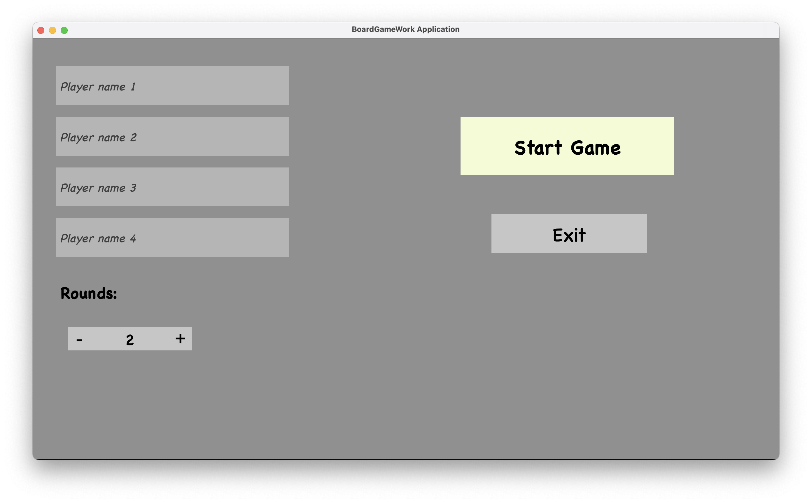
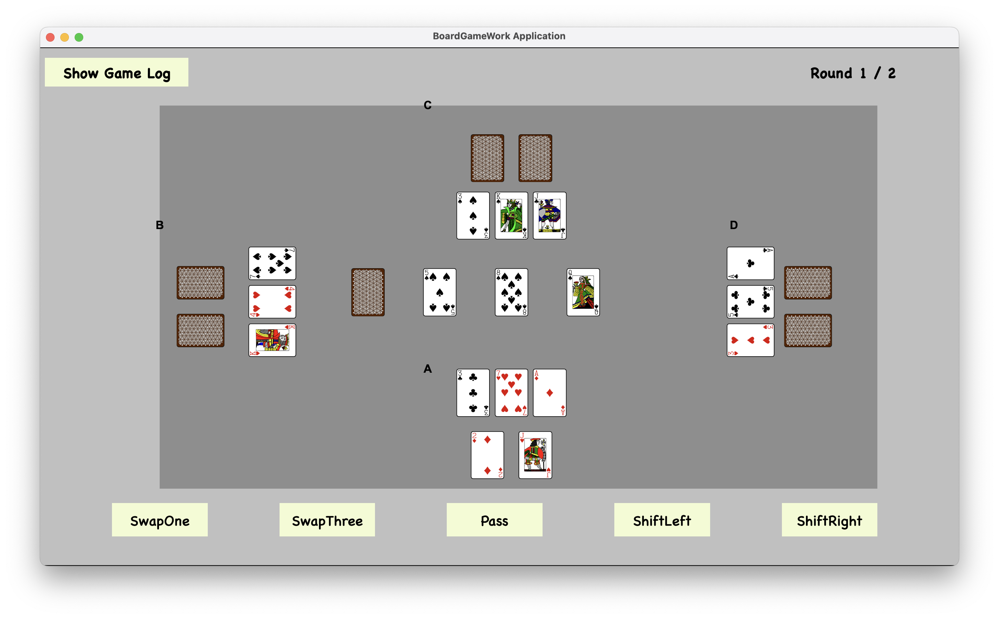
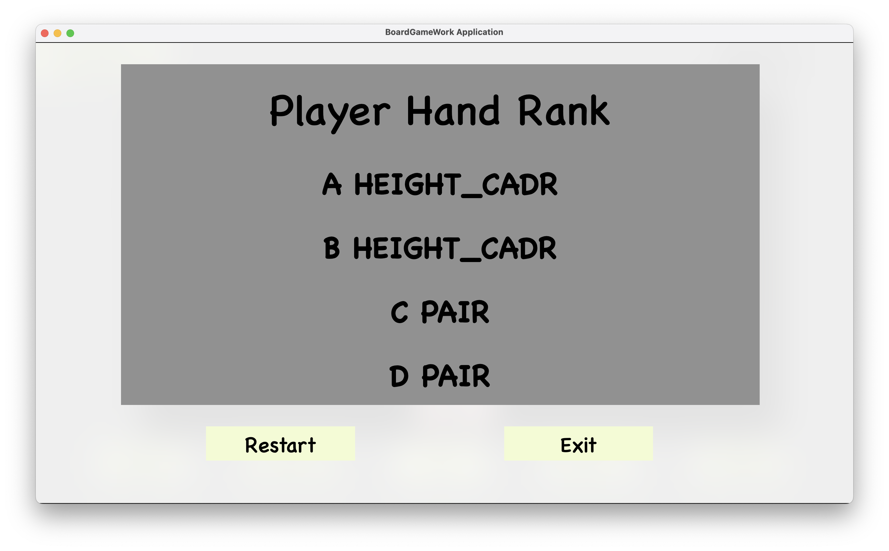

# Shift Poker

---

## 📜 Game Rules

---
Shift Poker is a card game for 2-4 players, played with a standard deck of 52 cards:

* **Suits:** Clubs ♣️, Spades ♠️, Hearts ♥️, Diamonds ♦️
* **Ranks:** 2, 3, 4, 5, 6, 7, 8, 9, 10, Jack, Queen, King, Ace

**Setup & Gameplay:**
* Each player receives **two hidden cards** and **three open cards**.
* **Three open cards** are placed in the middle.
* The remaining cards form a **draw pile**.
* Additionally, there is a **discard pile**, which is empty at the start of the game.
* Players agree on a number of rounds to play, between **two and seven**.

## Game Play 

---
Starting with a random player, players take turns in sequence. Each turn, a player must perform two actions:

### Action 1 - Shift 

* When shifting left, the three center cards shift to the left. The leftmost card is removed and placed face-up on the discard pile. The remaining two cards move one position to the left, and the newly freed spot on the right is filled with a fresh card from the draw pile.
* Shifting right is analogous.

### Action 2 - Swap

The player either:

* Swaps one of their open cards with one from the middle,
* Swaps all three of their open cards with the three cards in the middle,
* Or decides not to swap.

# Evaluation

---
The evaluation of hands follows traditional poker rules, but if two players have the same combination (e.g., One Pair), it is considered a tie without considering the rank of the cards in hand. [Wikipedia](https://de.wikipedia.org/wiki/Poker)

## Start new game scene

---

## Game scene 

---

## End game

---

